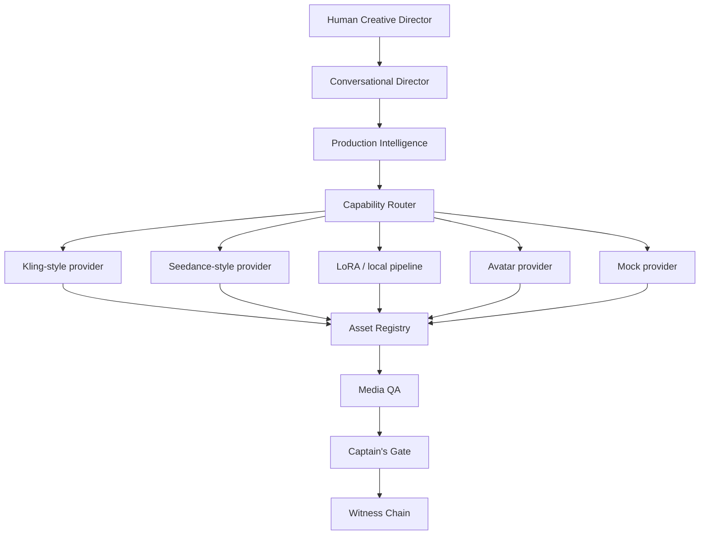

# Reference Architecture

## Trust boundaries

- Human authority is external to the generation providers.
- Provider output is untrusted until registered and reviewed.
- Local writes are restricted to configured project roots.
- Rights records are mandatory for real likeness and cloned voice use.
- Release requires explicit approval events.
