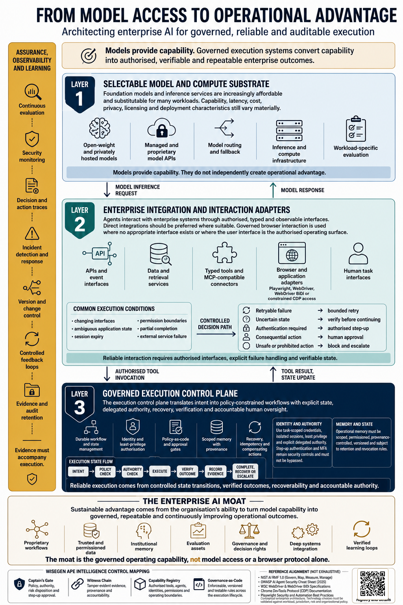

# WiseGen APE Governed Execution

**Version 1.0.0**

A local-first, production-oriented reference implementation for converting AI or human intent into policy-constrained, authorised, observable, recoverable and semantically verified enterprise actions.



## Core proposition

Models provide capability. Governed execution systems convert capability into authorised, verifiable and repeatable enterprise outcomes.

The repository implements the control-plane layer of the infographic:

- **Captain's Gate:** policy decisions, authority checks, step-up and independent approval
- **Witness Chain:** redacted, append-only, hash-linked and HMAC-signed execution evidence
- **Capability Registry:** explicit tool contracts, actor entitlements, parameter allowlists and operating boundaries
- **Governance-as-Code:** versioned rules that permit, hold, escalate or block actions before execution

## What is executable

The bundled demonstration runs five end-to-end cases:

1. A low-consequence HTTP action that is allowed and semantically verified
2. A S$2,500 action held pending independent finance approval
3. The same action completed using a short-lived, single-use approval token bound to the exact request
4. A S$75,000 action blocked before any target-system invocation
5. A browser form completed through an isolated Chromium process using CDP over pipe, fixed selectors and browser-level input events

The core has **no external npm dependencies**. It uses Node.js built-ins, a local JSON configuration and Chrome or Chromium for the optional browser path.

## Quick start

### Requirements

- Node.js 20 or later
- Chrome or Chromium for the browser demonstration
- Linux, macOS or Windows with an accessible Chromium executable

### Run the complete demonstration

```bash
cd wisegen-ape-governed-execution-v1.0.0
cp .env.example .env
npm run demo
```

A successful run reports:

```json
{
  "note": "SUCCEEDED",
  "transferBeforeApproval": "AWAITING_APPROVAL",
  "transferAfterApproval": "SUCCEEDED",
  "oversizedTransfer": "BLOCKED",
  "browserForm": "SUCCEEDED"
}
```

It also verifies the Witness Chain and returns its final head hash.

### Run the tests

```bash
npm test
npm run test:browser
npm run check
```

### Generate production credentials

```bash
rm -f .env
npm run keygen
```

The generated `.env` is created with restrictive filesystem permissions. Production mode refuses the bundled demonstration credentials.

## Operate the local control API

Start the demonstration target in one terminal:

```bash
node src/cli.js demo-target
```

Start the authenticated control API in another terminal:

```bash
npm run serve
```

Execute a low-consequence request:

```bash
./examples/control-api-curl.sh
```

The API binds to `127.0.0.1` by default and requires a bearer token for all endpoints except `/health`.

## Execution contract

Every request follows this lifecycle:

```text
RECEIVED
  -> POLICY_EVALUATED
  -> BLOCKED | STEP_UP_REQUIRED | AWAITING_APPROVAL | AUTHORISED
  -> EXECUTING
  -> RETRY_PENDING | VERIFYING | FAILED
  -> SUCCEEDED | STATE_UNCERTAIN | FAILED
```

Action completion is not treated as outcome correctness. Each capability defines semantic postconditions, such as a response status, transaction identifier, exact status value, final URL or observed interface state.

## Repository structure

```text
config/                 Capability, policy and runtime configuration
schemas/                Machine-readable contract schemas
docs/                   Architecture, governance, threat model and runbooks
examples/               Executable request and approval examples
fixtures/               Local browser demonstration page
src/core/               Policy, approval, state, verification and evidence logic
src/adapters/           HTTP and isolated Chromium CDP-pipe adapters
src/demo/               Local target system and full demonstration runner
scripts/                Key generation, linting and cleanup
test/                   Unit, integration and browser tests
var/                    Runtime evidence and approval state
```

## Security posture

The default browser adapter:

- launches a fresh isolated user-data directory for each execution
- does not attach to a person's default browser profile
- communicates over operating-system pipes rather than exposing a debugging TCP port
- restricts navigation, fixture files, selectors and observations through capability contracts
- uses browser-level CDP input events rather than fabricated `data-ax-id` attributes or arbitrary coordinate clicks
- destroys the temporary profile after execution

The Witness Chain is tamper-evident within one administrative trust domain. It is not a blockchain and does not provide external non-repudiation. For regulated deployments, use an external append-only evidence store, managed signing keys, trusted timestamps and independent retention controls.

The supplied Compose profile sets `BROWSER_NO_SANDBOX=1` because it also applies a restricted container security profile. Treat this as a demonstration configuration. Production browser work should run in a dedicated hardened worker with an organisation-approved browser sandbox and network policy.

## Adaptation path

To add a governed capability:

1. Define the capability, roles, operation, parameter allowlist and semantic postconditions in `config/capabilities.json`.
2. Add explicit policy rules in `config/policies.json`.
3. Use an existing adapter or implement a narrowly scoped adapter.
4. Add unit, integration and negative tests.
5. Update the threat model, source register and operational runbook.
6. Conduct Captain's Gate review before enabling the capability.

See [Adaptation Guide](docs/adaptation-guide.md).

## Deployment boundary

This repository is a complete executable reference system, not a compliance certificate. Before use with real personal data, money, employment decisions, health information, privileged accounts or safety-critical systems, complete organisation-specific security testing, legal review, data protection assessment, operational acceptance and independent assurance.

## Licence

MIT. See [LICENSE](LICENSE).
