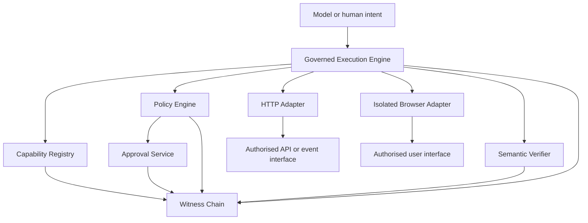
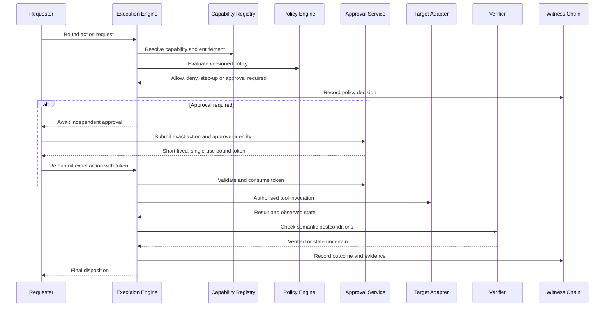

# Architecture

## 1. Purpose

The control plane translates an authorised request into a bounded action and records enough evidence to determine what was requested, which policy applied, who authorised it, what was executed and whether the intended postcondition was observed.

It deliberately separates four concerns:

1. Model or human intent
2. Tool and system integration
3. Policy-constrained execution
4. Assurance, evidence and controlled learning

## 2. Component model

## 3. Control sequence

## 4. Trust boundaries

| Boundary | Controlled by | Primary controls |
|---|---|---|
| Requester to control plane | Control API or CLI | Authentication, schema checks, body limits, role claims |
| Control plane to policy | Governance configuration | Versioning, default deny, precedence, negative tests |
| Control plane to adapter | Capability Registry | Adapter binding, parameter allowlists, origin and file boundaries |
| Adapter to target system | Target contract | Idempotency, timeouts, fixed selectors, semantic verification |
| Control plane to evidence store | Witness Chain | Redaction, sequence, previous hash, HMAC signature, single writer |
| Requester to approver | Approval Service | Separation of duties, exact-action binding, expiry, single use |

## 5. Browser execution

The browser adapter uses Chromium's DevTools Protocol through `--remote-debugging-pipe`. The browser process is created per action with a new temporary user-data directory. The adapter supports:

- allowlisted navigation
- allowlisted local content fixtures for repeatable tests
- CSS-selector resolution from capability configuration
- focus, text insertion and browser-level mouse input
- constrained observations of text, value or checked state

It does not accept arbitrary JavaScript from the request and does not persist authenticated state.

## 6. Reliability model

Reliability is defined as bounded and evidenced execution, not guaranteed success. The engine distinguishes:

- **BLOCKED:** policy prohibited execution
- **AWAITING_APPROVAL:** exact action requires independent approval
- **STEP_UP_REQUIRED:** stronger authentication or human presence is required
- **FAILED:** execution could not complete within the defined contract
- **STATE_UNCERTAIN:** an action may have occurred, but semantic postconditions were not established
- **SUCCEEDED:** all required semantic postconditions passed

Automatic retry is permitted only when the adapter classifies the failure as retryable and the capability contract marks the operation idempotent.
